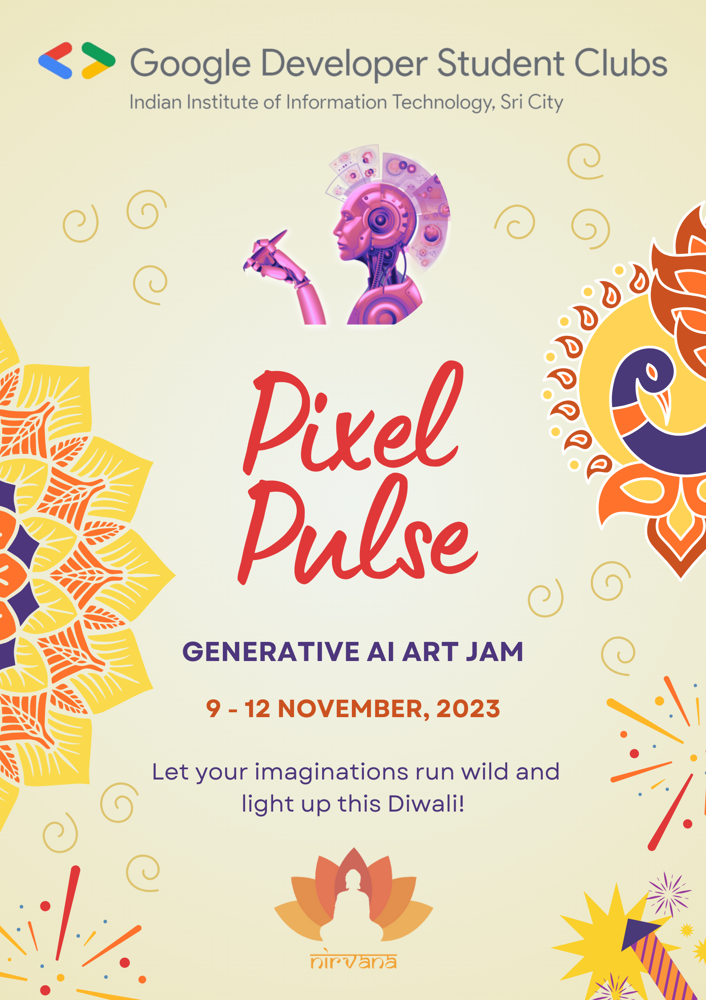

# Pixel Pulse: Gen-AI Art Jam 🖌️

[Link to Registration Form](https://docs.google.com/forms/d/e/1FAIpQLSermVMkUKmXf5WqYcakQCrLYbeq0p22WMzhuDXfX8WcqjPOaw/viewform?usp=sf_link)

**[Link to Submission Form](https://docs.google.com/forms/d/e/1FAIpQLSfTL4Gf-WBOzWl-omvF9nuNlNXuihIGSmzp-tfk3VlZsXmRRA/viewform?usp=sf_link)**

Join us for an electrifying celebration of creativity this Diwali! 🎨✨

Nirvana and GDSC are teaming up to bring you an exhilarating Generative AI Art Creation Competition! **Simply put, you need to generate creative artwork using AI Models such as DALL-E, Midjourney or any other model of your choice.**

Get ready to explore the cutting-edge world of smart prompt engineering and the latest open-source AI models. You have the chance to outshine the competition, win incredible prizes, and, best of all, earn your certificates!

Whether you're an AI enthusiast, an artist, or simply curious about the limitless possibilities of technology, this event is for you. Let your imagination run wild as you create art that transcends boundaries and lights up the festival of Diwali with your unique vision.

Don't miss out on the opportunity to be a part of this epic collaboration. Mark your calendars and prepare to ignite your creativity like never before!

Stay tuned for more details, and get ready to unleash your artistic genius. This Diwali, we're taking art to a whole new level. See you there! 🎉

**Register now, to get resources, tips and tricks on your email.** (Note: The submission form is different)

[Register Now](https://docs.google.com/forms/d/e/1FAIpQLSermVMkUKmXf5WqYcakQCrLYbeq0p22WMzhuDXfX8WcqjPOaw/viewform?usp=sf_link)

## Rules

1. You can work anytime, and from anywhere. Your work can be broken down into these steps:
	- Get a basic idea about Generative AI, and models which can generate images.
	- Glance through different terminology related to different art forms.
	- Use a model hosted online (like DALL-E or Midjourney) or install and setup some open source model on your own local machine.
	- Experiement with different prompts and try to create mind blowing work.
1. You need to submit your creations by **12th November 11:59 AM**.
2. You can take full liberty in your creative expression. But the images you submit must be somehow related to our theme "**Diwali: Celebrating Triumph of Goodness**". Every form of art is welcome.
3. All submissions must comply with GDSC and Nirvana Code of Conduct.
4. It is not neccessary for you to write yourself the prompt you feed the Image Generation Model. You can use LLMs like Chat GPT, to generate your prompts. Whatever you do, the initial/seed prompt, must be uniquely yours and you need to document all steps taken by you to reach the final image.
5. Plagiarism is strictly prohibited.
6. **Judging Criteria (100 points)**:
	- Creativity (30 points)
	- Usage of Open Source Models (30 points)
	- Exploration of multiple models for best art generation (20 points)
	- Explaining the process of Prompt Engineering (the entire pipeline) (20 points)
7. Submission Format: A google drive folder link
	- Create a Google Drive Folder
	- **You can Submit upto 5 images.**
	- Upload all the full resolution generated images
	- Create a Google Doc in the same folder, and write your prompts and process for generation for each image
	- Folder Name: RollNo_PixelPulse

## Resources

1. [Introduction to Generative AI by Google Cloud Tech](https://www.youtube.com/watch?v=G2fqAlgmoPo)
2. [Videos related to AI Image Generation](https://www.youtube.com/results?search_query=ai+image+generator+open+source)
3. [WAYS To Get Started With AI ART [Beginner's Guide 2023]](https://www.youtube.com/watch?v=zxnXpSfoXhQ)
4. [Google's Imagen (unprecedented photorealism × deep level of language understanding)](https://imagen.research.google/)

