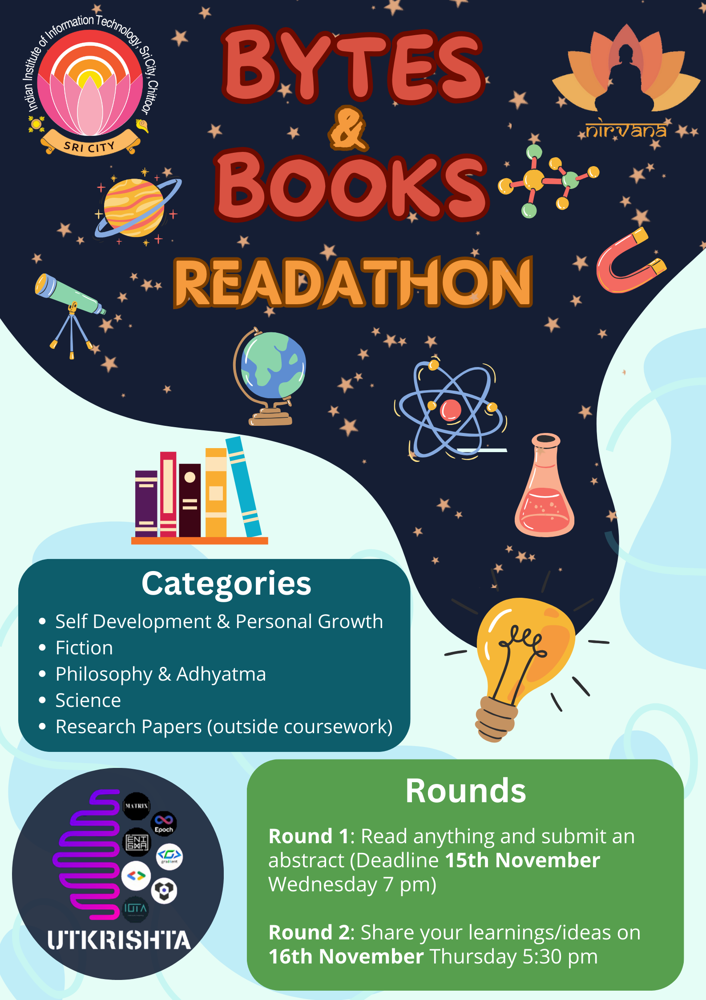

# Bytes and Books

**[Register Now](https://docs.google.com/forms/d/e/1FAIpQLSebFaIx1vY3uYm8MJM5dTgIas73pvvB9el6umy4IK-7rdXCLA/viewform?usp=sf_link)**

**[Submission Form](https://docs.google.com/forms/d/e/1FAIpQLSdvYpm8W52cC84nvYEqOBKCcqB_3-yTapMmza838m5nAMAVnQ/viewform?usp=sf_link)**

**[Register Now](https://docs.google.com/forms/d/e/1FAIpQLSebFaIx1vY3uYm8MJM5dTgIas73pvvB9el6umy4IK-7rdXCLA/viewform?usp=sf_link)**

Nirvana is organizing **Bytes & Books: Readathon** to promote reading and improve focus skills. Participants can choose from various categories of books, and there are two levels of participation: submitting an abstract and sharing their learnings/ideas through a short talk.

Prizes include certificates for all participants, certificates of merit for the top 10 abstracts, and special prizes for the top 3.

## Motivation

One of the most important things in any intellectual profession is reading.

Whether you plan to join industry as a software developer, or work in academia as a Prof/Researcher, you will definitely need to read a tons of books,research papers and code/documentation.

In this age of youtube shorts and insta reels, our attention span and focus are severely hampered.

To develop reading and focus skills, and to gain back our attention from addictive/compulsive behaviours, we are organizing a Readathon.

## Categories

You can read any book you wish from the following **categories**:

1. Self Development & Personal Growth
2. Fiction
3. Philosophy & Adhyatma (Spirituality)
4. Science
5. Research Papers (outside coursework)

## Round 1: Submit an Abstract

- **Deadline**: Wednesday 15th November, 7 PM
- It is okay if you are able to complete only a part of the book you planned to read.
- You need to submit an abstract **(under 500 words)** containing:
	- the summary of what you have read
	- how reading helped improve your focus, and acheive flow state
	- what you enjoyed during the process

### Submission Format and Rules

- Write your abstract in a Google Doc file.
- You need to submit a link to Google Doc (Share access: Any with link can view)
- Submission form link -> [View form](https://docs.google.com/forms/d/e/1FAIpQLSdvYpm8W52cC84nvYEqOBKCcqB_3-yTapMmza838m5nAMAVnQ/viewform?usp=sf_link)

## Round 2: Present your learnings

Top 10 candidates who submitted the best abstracts will be invited infront of the panel of students and Profs to give a small talk and present their learnings/ideas.

The presentation would be of 5 minutes, followed by Q/A by the panel.

## Recognition

- Certificate of Participation for everyone who submits a valid abstract.
- Certificate of Merit to top 10 selected abstracts.
- Attractive Prizes for top 3 winners of final round.